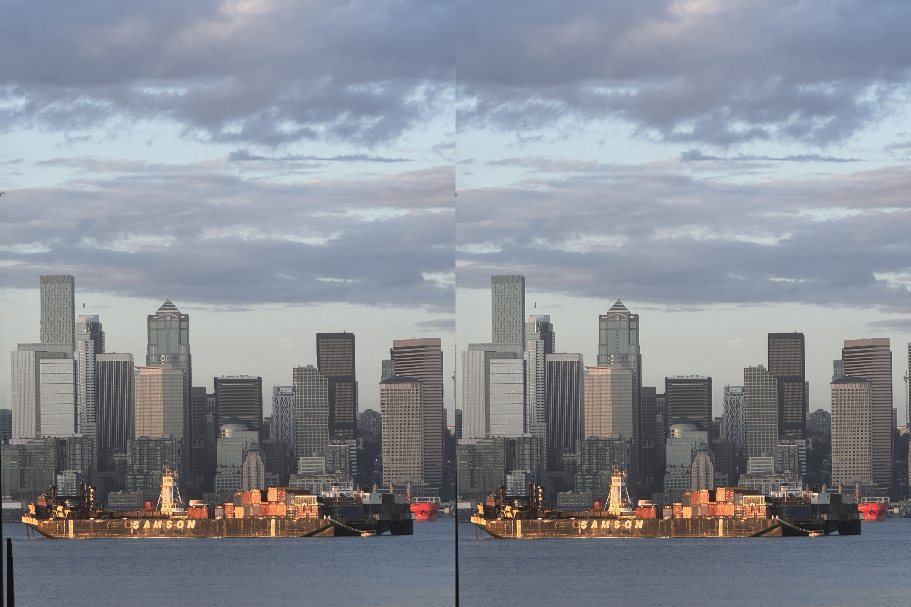
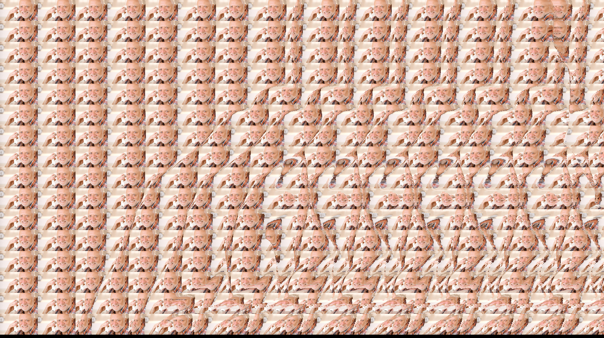

# StereoVision Plugin for ComfyUI

The StereoVision plugin for ComfyUI enables the creation of stereoscopic and autostereoscopic images and videos using depth maps. It supports both traditional stereoscopic image generation and autostereogram (Magic Eye) creation.

## Components

The plugin provides two primary nodes:

1. **Stereoscopic Generator**: Creates side-by-side stereoscopic images from base images and depth maps
2. **Autostereogram Generator**: Produces autostereograms from depth maps

## Stereoscopic Generator

### Usage

1. **Input Requirements**
   - Base Image: The source image for conversion
   - Depth Map: Corresponding depth information (lighter = closer, darker = further)

2. **Node Setup**
   - Add the Stereoscopic Generator node
   - Connect base image to `base_image` input
   - Connect depth map to `depth_map` input

3. **Parameters**
   - `depth_scale`: Controls 3D effect intensity (default: 80)
     - Higher values increase depth separation
     - Lower values produce subtler effects

### Technical Considerations

- Image Selection
  - Clear foreground/background separation improves results
  - Consistent depth mapping enhances effect quality
  - High-contrast scenes may require lower depth scale values

- Processing Requirements
  - Higher resolution inputs require more processing time
  - Video processing may need significant computational resources

### Example Output

#### Seattle (Use cross-eyed technique to view 3D)

#### Video Demonstration

## Autostereogram Generator

### Usage

1. **Input Requirements**
   - Depth Map: Defines the hidden 3D image
   - Optional Texture: Custom pattern for the autostereogram

2. **Core Parameters**

   - `pattern_div`: Pattern width (integer)
     - Low values: Larger patterns, easier viewing
     - High values: Smaller patterns, more detail

   - `depth_multiplier`: Depth effect intensity
   - `invert`: Reverses depth perception
   - `x_tiles`, `y_tiles`: Pattern repetition count

3. **Pattern Configuration**

   - Pattern Types:
     - Random
     - Perlin
     - Dots
     - Lines
     - Checkers
     - Waves

   - Noise Parameters:
     - `noise_scale`: Pattern size
     - `noise_octaves`: Pattern complexity

   - Color Options:
     - Grayscale
     - RGB
     - Complementary

4. **Batch Processing Controls**
   - `clamp_depth_to_first`: When enabled, uses the first depth map frame for all outputs
   - `clamp_texture_to_first`: When enabled, uses the first texture frame for all outputs
   - These options are useful for:
     - Creating consistent autostereograms across multiple frames
     - Maintaining pattern continuity in animations
     - Reducing visual noise in batch processing

5. **Output Settings**
   - Custom width/height support
   - Default: matches depth map dimensions

### Technical Parameters

Pattern Division Effects:
- 4: Large patterns, basic depth perception
- 16: Fine patterns, detailed hidden images

Noise Configuration:
- Scale Range: 0.5 (fine) to 2.0 (coarse)
- Octaves: 2-6 (higher = more complex)

### Example Output

#### Harold (texture based)
*Use parallel viewing technique to see the hidden 3D image*

#### Harold (noise based)
*Use parallel viewing technique to see the hidden 3D image*

#### Video Demonstration

## Implementation Notes

1. **Performance Optimization**
   - Match output resolution to viewing requirements
   - Consider computational load for video processing
   - Monitor memory usage with high-resolution inputs

2. **Quality Control**
   - Verify depth map accuracy
   - Test various pattern settings for optimal viewing
   - Validate output across different display sizes

3. **Error Prevention**
   - Ensure consistent input dimensions
   - Validate depth map grayscale values
   - Monitor processing resource usage

## Technical Specifications

- Input Formats: Standard image formats
- Output Resolution: Configurable or source-matched
- Processing: CPU-based computation
- Memory Requirements: Scales with input resolution

### Example Implementation

For detailed implementation examples and advanced usage scenarios, refer to the plugin's source code and example workflows.
